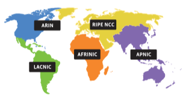

# **IANA (Internet Assigned Numbers Authority / İnternet Tahsisli Sayılar Otoritesi)**

İnternet Tahsisli Sayılar Otoritesi (IANA), küresel IP adresi tahsisi, otonom sistem numarası tahsisi, kök bölgesi yönetimi, Alan Adı Sistemi (DNS), medya türleri ve İnternet protokolü ile ilgili diğer semboller ve İnternet numaralarını denetleyen bir standartlar organizasyonudur.

| Registry | Area Covered                              |
| -------- | :---------------------------------------- |
| AFRINIC  | Africa Region                             |
| APNIC    | Asia/Pacific Region                       |
| ARIN     | Canada, USA, and some Caribbean Islands   |
| LACNIC   | Latin America and some Caribbean Islands  |
| RIPE NCC | Europe, the Middle East, and Central Asia |

Yani bu durumda Türkiye RIPE NCC’ye bağlı oluyor.
