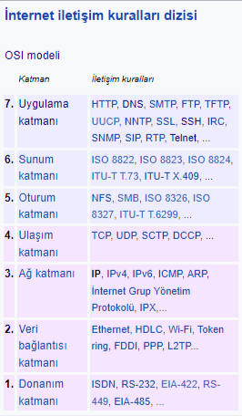

# OSI KATMANLARI

### 1. Physical Layer	(Fiziksel Katman)

### 2. Data Link Layer	(Veri Bağlantı Katmanı)

### 3. Network Layer	(Ağ Katmanı)[SEGMENT]

* Paket denir->Source IP - Destination IP(segment)
* Logical Adres
* Path Determination ->OSPF - BGP

### 4. Transport Layer	(Taşıma Katmanı)[SEGMENT]

* Segment
  * Segmentation
* Flow	Control
* Error	Control
* TCP(TRANSFER CONTROL PROTOCOL)/UDP(USER DATAGRAM PROTOCOL)

### 5. Session Layer	(Oturum Katmanı)

* Authentication	Layer
* Authorization	Layer
* Session Management

### 6. Presentation Layer	(Sunu Katmanı)

- Translation
- ASCI->Binary->0101010
- Compression
  - lossy
  - lossless
- Encryption
  - SSL
- Decryption
  - SSL

### 7. Application Layer	(Uygulama Katmanı)

- Browser-HTTP/HTTPS
- Email-SMTP
- File Transfer-FTP
- Virtual Terminal-TELNET

# **OSİ REFERANS MODELİ**

İhtiyaçlar doğrultusunda network üzerinde kullanılan karmaşık uygulamalar, ağ tipleri bu hiyerarşinin doğumunu kaçınılmaz hale getiren sebeplerdendir. Ağlar büyüdükçe yönetimi zorlaştı ve sorun çözümleri de beraberinde zorlaştı.

Uluslararası Standartlar Organizasyonu (ISO) birçok ağ yapısını inceleyerek 1984 yılında OSI referans modelini geliştirdi. Artık donanım ve yazılım firmaları bu standarda uygun ürünler üretmeye başladılar.

OSI modelinde 7 katmanlı bir yapı kullanılmış ve bu model; karmaşıklığı azaltmış, insanların belli katmanlarda uzmanlaşması için referans olmuş, katmanların işlevlerinin öğrenilmesi ve öğretilmesi kolaylaşmış, farklı donanım ve yazılım ürünlerinin birbirleriyle uyumlu çalışmasını sağlamış ve bir katmanda yapılan değişiklikler diğer katmanları etkilemediği için işbirliği, görev paylaşımı problem çözümü gibi konularda kolaylıklar getirmiştir.

Bahsedilen OSI katmanlarının sıralaması aşağıdaki gibidir.

### 1. Physical Layer (Fiziksel Katman)

Verinin bitler (0 ve 1'ler) halinde fiziksel ortamda (kablo, radyo dalgası vb.) iletilmesini sağlar. Elektriksel sinyallerin nasıl iletileceğini ve bağlantı türlerini tanımlar.
**Örnek:** Kablolar, konektörler, hub.

### 2. Data Link Layer (Veri Bağlantı Katmanı)

Aynı ağ üzerindeki cihazlar arasında çerçeve (frame) oluşturur, MAC adresiyle iletişimi sağlar ve fiziksel iletim hatalarını algılar. Switch'ler bu katmanda çalışır.
Örnek: Switch, MAC adresi, Ethernet.

Fiziksel adreslemenin ve network ortamında datanın nasıl taşınacağının tanımlandığı katmandır. Burada fiziksel adreslemeden kastettiğimiz şey MAC(Media Access Control) adresidir. Bu katman Hakemlik, Adresleme, Hata Saptama, Kapsüllenmiş datayı tanımlama fonksiyonlarına sahiptir.

Ethernet hakemlik için CSMA/CD (Carries Sense Multiple Access with Collision Detect) adı verilen bir algoritmayı kullanır. Bu algoritma şu adımlardan oluşur;

* Hatta boş olup olmadığını dinler
* Boşsa data gönderir
* Doluysa bekler ve dinlemeye devam eder
* Data transferinde çarpışma olursa durur ve tekrar dinlemeye başlar.

Adresleme için, MAC adresi, Unicast adresi, broadcast adresi ve multicast adresi örnek olarak verilebilir.

Bu katmanda kullanılan protokollere şu örnekler verilebilir;

* HDLC
* PPP
* ATM
* Frame Relay

### 3. Network Layer (Ağ Katmanı)

Verinin bir ağdan başka bir ağa nasıl gideceğini belirler ve IP adresiyle yönlendirme yapar. Paketlerin hedefe ulaşmasını sağlar.
**Örnek:** Router, IP adresi, ICMP.

Bu katman bir paketin yerel ağ içerisinde ya da diğer ağlar arasındaki hareketini sağlayan katmandır. Bu hareketin sağlanabilmesi için hiyerarşik bir adresleme yapısı gerekmektedir. Gelişen teknolojiyle birlilkte mevcut ağlarında büyüme eğiliminde olması adresleme yapsınının hiyerarşik olmasını gerektirmektedir. Ayrıca hiyerarşik sistem dataların hedef bilgisayara en etkili ve en kısa yoldan ulaşmasını da sağlar.

Bu katmanın bir özelliği olan “adresleme” sayesinde bu sağlanabilmiştir. Adresleme Dinamik yada statik olarak yapılabilir. Sabit adresleme el ile yapılan adreslemedir. Dinamik adresleme de ise otomatik olarak ip dağıtacak örneğin DHCP gibi bir protokole ihtiyaç vardır.

Ayrıca bu katmanda harekete geçen bir datanın hedefine ulaşabilmesi için en iyi yol seçimide yapılır. Bu işleme Routing denir. Bu işlemi yerine getiren cihaza ise Router denilir. Router en basit tarifi ile en iyi yol seçimini yapar ve broadcast geçirmediği için ağ performansını olumsuz etkilemez. Bu katmanda kullanılan protokollere de şu örnekler verilebilir;

* IP
* ARP
* RARP
* BOOTP
* ICMP

### 4. Transport Layer (Taşıma Katmanı)

Veriyi hedef cihaza doğru sırayla ve eksiksiz ulaştırır. Akış kontrolü, hata düzeltme ve bağlantı yönetimini yapar.
**Örnek:** TCP, UDP.

Bu katman nakil edilecek datanın bozulmadan güvenli bir şekilde hedefe ulaştırılmasını sağlar. Üst katmanlardan gelen her türlü bilgi nakil katmanı tarafından diğer katmanlara ve hedefe ulaştırılır. Gönderilen datanın bozulmadan ve güvenli bir şekilde hedefe ulaşıp ulaşmadığını uygun protokollerle kontrol edebilir. Bu katmanda çalışan protokollere verilebilecek bazı örnekler şunlardır;

* TCP
* UDP

Bu katmanın en önemli iki fonksiyonun Güvenlik ve Akış kontrolüdür.

Güvenlilik bilgisayarlar arasından gerçekleştirilen data transferinde datanın sağlıklı bi şekilde hedefe gönderilip gönderilmediğini yöneten, gönderilmediği durumlarda tekrar gönderilmesini sağlayan fonksiyondur.

İletişim halindeki bilgisayarlarda datayı gören bilgisayar alıcının kapasitesinden üzerinden datalar gönderebilirler. Böyle bir durumda datayı alan bilgisayar alamadığı paketleri yok edecektir ki önlemek için Nakil Katmanı Ara Bellekleme, tıkanıklıktan kaçınma ve pencereleme metodlarını kullanarak akış kontrolünü sağlar.

Ara bellekleme de datanın akış hızına müdahale etmeden, kapasitenin üzerindeki datanın ara belleğe alınması, tıkanıklıktan kaçınma metodunda ICMP Source Quench mesajı ile gönderilen bilgisayarın göndeirmini yavaşlatması, Pencerelem metoduyla paketlerin gruplar halinde gönderilmesi sağlanır.

### 5. Session Layer (Oturum Katmanı)

İki cihaz arasında oturum (bağlantı) kurar, iletişim süresince bu oturumu yönetir ve gerektiğinde yeniden başlatır veya sonlandırır.
Örnek: Oturum açma protokolleri (NetBIOS, RPC).

### 6. Presentation Layer (Sunu Katmanı)

Verinin uygulama tarafından anlaşılabilir bir formata dönüştürülmesini sağlar. Şifreleme, sıkıştırma ve veri formatlama bu katmandadır.
Örnek: JPEG, MP3, SSL, veri şifreleme.

### 7. Application Layer (Uygulama Katmanı)

Kullanıcının doğrudan etkileşimde bulunduğu ağ hizmetlerini sunar. E-posta, dosya transferi ve web hizmetleri gibi uygulamalara destek sağlar.
Örnek: HTTP, FTP, SMTP, DNS.**
