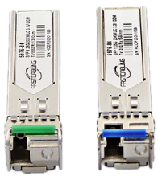

# **BiDi SFP / Bi-Direcitonal SFP**

Bidi SFP/ Bidirectional SFP modülüdür. Tek bir core üzerinden hem rx hemde tx trafiğini taşıyabilme özelliğine sahip olan sfp tipidir. Bunu tek core fiber üzerinden yapabilmesi için rx ve tx trafiğinin sinyal nm değerlerini manipüle eder ve örneğin rx 850nm ile gidiyorsa tx trafiği 1310nm ile gidiyordur. Genellikle ISP'lerde kullanılır.
